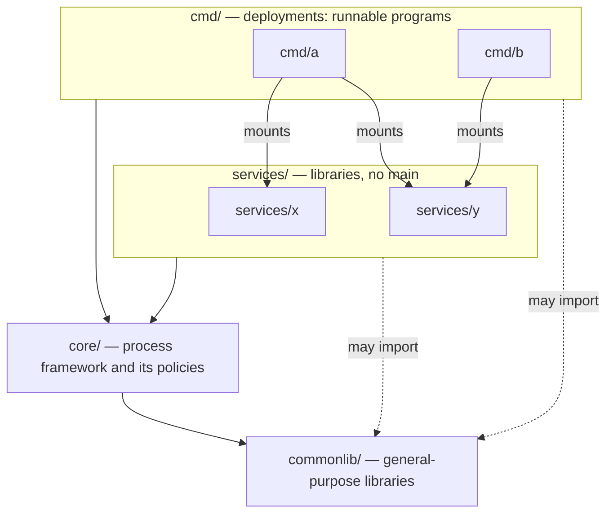
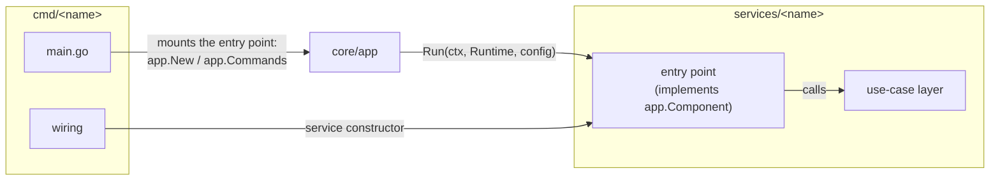

# github.com/kienvan102/monorepo-microservices-template

A template for Go monorepos whose services build and deploy independently. Each service is a library; each deployment under `cmd/` mounts one or more services into a runnable program, built on a shared process framework (`core/`) and general-purpose libraries (`commonlib/`).

## Starting a project from this template

Copy the template, then run once from the repo root:

```bash
bash scripts/init-project.sh github.com/your-account/your-repo
```

It:

- renames every Go module path to yours
- resets `docs/backlog.md`
- deletes itself when done

Options:

| Option | Effect |
| --- | --- |
| `--strip-examples` | Also removes the example service (`services/mongoanalyzer`) and deployment (`cmd/db-analyzer`) |
| `--dry-run` | Shows what would change, without writing anything |

## Example

The template ships with one working example:

| Tool | What it's for |
| --- | --- |
| [**db-analyzer**](cmd/db-analyzer/README.md) | Collects metrics from a MongoDB collection to support index design. Read-only, never modifies data. |

To run a tool: open its README and follow "First run".

## Configuration

Each tool reads configuration from 4 layers. The value comes from the highest layer that declares it:

1. Real environment variables (`export`, `docker run -e`/`--env-file`).
2. The tool's `.env` file (`cmd/<name>/.env`). Skipped if the file doesn't exist.
3. The tool's YAML file (`cmd/<name>/config.yaml`).
4. The default value in code.

Usually `config.yaml` holds configuration that's ready to run as-is, while `.env` only declares the values you need to override on your own machine — for example, a URI with a password.

A tool's `config.yaml` is a plain nested YAML mapping, one entry per config field — for example, this is `cmd/db-analyzer/config.yaml`:

```yaml
mongo:
  uri: mongodb://localhost:27017
queryTimeout: 20s
```

Every key path maps to an environment-variable name, the same one you set in `.env` or `docker run -e` to override it:

| YAML key | Variable name |
| --- | --- |
| `mongo.uri` | `MONGO_URI` |
| `queryTimeout` | `QUERY_TIMEOUT` |
| `mongoURI` | `MONGO_U_R_I` |

Keys in this repo's `config.yaml` files are camelCase (`queryTimeout`, `outputDir`, `sampleSize`). The loader:

- treats `_`, `-`, and every capital letter as a word boundary, so `query_timeout` and `query-timeout` also map to `QUERY_TIMEOUT`
- splits an acronym letter by letter: `mongoURI` becomes `MONGO_U_R_I`. Write acronyms as one word: `mongoUri` maps to `MONGO_URI`

Each tool's own README lists its full set of variables.

### Logs

`APP_ENV` (`appEnv:` in `config.yaml`, default `dev`) sets how a tool logs:

| `APP_ENV` | Format | Lowest level |
| --- | --- | --- |
| `dev`, `testing` | readable console lines | debug |
| `staging`, `production` | one JSON object per line | info |

Every entry records:

- the file, line, and function that logged it
- a stack trace, on error entries only

JSON written to a terminal is colored for reading, and stays plain when written to a file or pipe. Set `NO_COLOR=1` to turn colors off, for example in a container started with `docker run -t`.

## Development

### Structure



```text
commonlib/          General-purpose libraries: logger, config, processor, mongoclient, jsonfile
core/               The process framework (app) and the conventions it applies
services/<name>/    A service, built as a library: use-case layer, entry points, config struct
cmd/<name>/         A deployment: a runnable program that mounts one or more services
go.work             Workspace so the editor sees every module at once
Makefile            Shared targets (tidy) + auto-includes cmd/*/Makefile
```

Dependencies point one way: `cmd` → `services` → `core` → `commonlib`, and services and deployments may also import `commonlib` directly. A deployment can mount several services, and a service can be mounted by several deployments.

| | `commonlib/` | `core/` |
| --- | --- | --- |
| Holds | General-purpose libraries | The framework and the conventions it applies |
| Knows about this repo | No: imports nothing from it | Yes |
| Put code here when | it's useful without `APP_ENV`, `app.Runtime`, components, or other repo conventions | it needs them |
| Example | `commonlib/logger` can write console or JSON | `core/app` decides staging and production write JSON |

### Services and deployments

A service's use-case layer takes plain inputs and returns a result or an error. It doesn't depend on how it is called: no flag parsing, no HTTP, no CLI package.

A service is more than its use-case layer. It also contains the code that receives an external call — a CLI flag, an HTTP request, a queue message — and turns it into a call to the use-case layer. That code lives inside the service, not the deployment, so the service can be reused and tested without any particular deployment.



A deployment:

- **Wires** the services it uses, with google/wire or by hand.
- **Mounts** their entry points: anything implementing `app.Component[C]` — a CLI, an HTTP server, a worker.
- **Runs** them all together in one process (`app.New`), or one at a time chosen by command name (`app.Commands`, git-style).

`core/app` handles flags, config loading, logging, signal handling, and coordinated shutdown for every deployment, so services and deployments don't implement them.

How a service arranges its packages is up to the service. The template relies on two things: a use-case layer with plain methods over a `context.Context`, and an entry point implementing `app.Component[C]`. mongoanalyzer, for example, uses `business/`, `repository/mongodb/`, `transport/cli/`, and `settings/`.

### Writing a service

1. `services/<name>/`: `go mod init github.com/kienvan102/monorepo-microservices-template/services/<name>`, then add a `require` + `replace` for both `core` and `commonlib`:

   ```bash
   go mod edit \
     -require=github.com/kienvan102/monorepo-microservices-template/core@v0.0.0 \
     -replace=github.com/kienvan102/monorepo-microservices-template/core=../../core \
     -require=github.com/kienvan102/monorepo-microservices-template/commonlib@v0.0.0 \
     -replace=github.com/kienvan102/monorepo-microservices-template/commonlib=../../commonlib
   ```

   Then `go work use ./services/<name>` at the root. Go applies `replace` only from the module being built, so every module needs its own `replace` for each in-repo module it depends on, even indirectly through `core`.
2. Config struct: use the `env` tag. Declare path fields as `config.Path` (from `commonlib/config`); relative values are resolved from the directory containing `config.yaml`. Don't declare `APP_ENV` — that value is already available on `app.Runtime`.
3. The entry point — a CLI, an HTTP handler, a worker loop, or any other way in — implements `app.Component[C]`, where `C` is the config struct: `InitFlags(fs)` declares flags, `Run(ctx, rt, cfg)` runs. For a one-shot run, `Run` returns once the work is done; for a long-running one, it returns when `ctx` is cancelled. It receives the service constructor from the deployment rather than building the service itself.

### Writing a deployment

1. `cmd/<name>/`: `go mod init github.com/kienvan102/monorepo-microservices-template/cmd/<name>`, `require` + `replace` for `core`, `commonlib`, and each service it uses, then `go work use ./cmd/<name>` at the root.
2. Build the service constructor with google/wire (see `cmd/db-analyzer/wire.go` as a template). Run `go tool wire` in the deployment's directory, and re-run it any time a service constructor changes.
3. `main.go` calls `processor.Main` (from `commonlib/processor`) with one of:

   | Call | Runs |
   | --- | --- |
   | `app.New(app.Mount(entryPoint), ...)` | every mounted entry point at once |
   | `app.Commands(map[string]app.Mounted{...})` | one, chosen by command name: `tool [shared flags] <command> [command flags]` |

   To change the log format, level, or output, pass `app.WithLogger(...)` to either.
4. A deployment with multiple services has them all read from one shared configuration set. Mount each service with its own prefix, `app.WithPrefix("x")`. That service then reads:

   - the YAML key `x:`
   - the variable `X_...`
   - the flag `-x-...` (only with `app.New`)

   Example with two services, the second mounted with `app.WithPrefix("m2")`:

   ```yaml
   appEnv: dev            # process-level: never prefixed
   mongo:                 # unprefixed service: MONGO_URI, MONGO_COLLECTION
     uri: mongodb://localhost:27017
     collection: threads_posts
   m2:                    # service prefixed with m2: M2_MONGO_URI, M2_MONGO_COLLECTION
     mongo:
       uri: mongodb://localhost:27017
       collection: facebook_posts_new
   ```

   In `.env` or `docker run -e`, use the prefixed name: `M2_MONGO_URI=...`. A key not declared under `m2:` falls back to that service's own code default; it does not inherit the unprefixed service's value. A service that needs to be deployed independently gets its own deployment.
5. Add:
   - `config.yaml`
   - a `Makefile` with a `<name>-` target prefix
   - a `Dockerfile` + `Dockerfile.dockerignore` following `db-analyzer`'s pattern

### Build

- Every module has its own `go.mod`. The Makefile and Dockerfile build each deployment with `GOWORK=off`, strictly against that deployment's own `go.mod`, so bumping one deployment's dependencies never affects another's build. `go.work` exists so the editor and the root-level `go` command see every module at once.
- A deployment consumes `commonlib`, `core`, and services through a `replace` pointing at the in-repo directory, so it always builds against the repo's current code.
- The root `Makefile` includes every `cmd/*/Makefile` into one shared `make` namespace, so each deployment's targets and default variables are prefixed with its own name (`db-analyzer-collect`, `db-analyzer-%: ENV_FILE ?= ...`).
- `Dockerfile.dockerignore` is a whitelist: it lets in only `commonlib/`, `core/`, the services that deployment uses, and the deployment's own directory, and always excludes `.env`.
