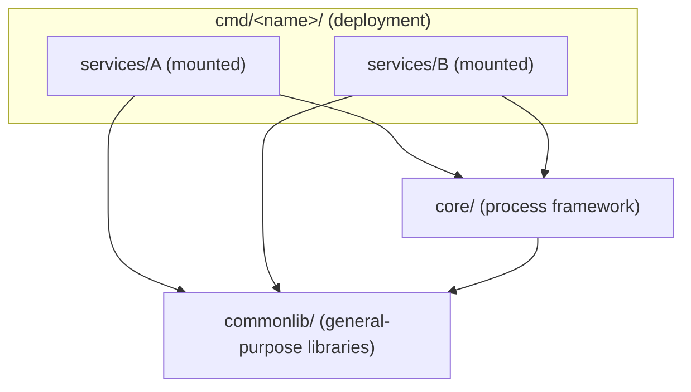

# github.com/kienvan102/monorepo-microservices-template

A collection of internal Go tools, organized as a monorepo: each tool builds and deploys independently.

## What runs

| Tool | What it's for |
| --- | --- |
| [**db-analyzer**](cmd/db-analyzer/README.md) | Collects metrics from a MongoDB collection to support index design. Read-only, never modifies data. |

To run a tool: open its README and follow "First run".

## Configuration

Each tool reads configuration from 4 layers. The value comes from the highest layer that declares it:

1. Real environment variables (`export`, `docker run -e`/`--env-file`).
2. The tool's `.env` file (`cmd/<name>/.env`). Skipped if the file doesn't exist.
3. The tool's YAML file (`cmd/<name>/config.yaml`).
4. The default value in code.

Usually `config.yaml` holds configuration that's ready to run as-is, while `.env` only declares the values you need to override on your own machine — for example, a URI with a password.

A tool's `config.yaml` is a plain nested YAML mapping, one entry per config field — for example, this is `cmd/db-analyzer/config.yaml`:

```yaml
mongo:
  uri: mongodb://localhost:27017
queryTimeout: 20s
```

Loading it flattens every key path into an environment-variable name, so it lines up with the same variable you'd set in `.env` or `docker run -e` to override it:

| YAML key | Variable name |
| --- | --- |
| `mongo.uri` | `MONGO_URI` |
| `queryTimeout` | `QUERY_TIMEOUT` |
| `mongoURI` | `MONGO_U_R_I` |

Every `config.yaml` in this repo uses camelCase for multi-word keys (`queryTimeout`, `outputDir`, `sampleSize`, ...) — that's the convention to follow, not something the loader enforces. The loader is more permissive than that: it treats `_`, `-`, and *each* capital letter as a word boundary, so `query_timeout` or `query-timeout` would resolve to that same `QUERY_TIMEOUT` too — it's just not the style actually used here. That same capital-letter rule is also why a camelCase acronym like `mongoURI` splits letter by letter into `MONGO_U_R_I` in the last row above (intentional, not a typo — worth avoiding multi-letter acronyms in camelCase keys for that reason).

Each tool's own README lists its full set of variables.

## Development

A service's use-case layer is, by definition, decoupled from how it's invoked: it takes plain inputs and returns a result or an error, with no dependency on a flag-parsing, HTTP, or CLI package. That's the distinction between "use-case logic" (or "business logic") and the layer that exposes it — a well-established one in software design, independent of whatever a given service happens to name that package.

The service as a whole, though, is not invocation-agnostic: something has to translate an external invocation — a CLI flag, an HTTP request, a queue message — into a call against the use-case layer. Think of that translation the way you'd think of a program's entry point, or an application's API surface. This template keeps that translation layer inside the service rather than the deployment — not because anything forces it there, but so the service stays reusable and testable independent of any one deployment. What a deployment actually contributes is narrower than "how it's run" suggests: it only picks which of a service's already-existing entry points to mount, and shapes the process around them — run mode, lifecycle, config.



A deployment does three things:

- **Picks and wires** one or more services together with `google/wire`.
- **Exposes** each as any transport implementing `app.Component[C]` — CLI, HTTP, worker, whatever `InitFlags`/`Run` needs to be.
- **Runs** them either all together in one process (`app.New`), or dispatched one at a time by command name (`app.Commands`, git-style).

Mounting more than one service into the same deployment doesn't cause config collisions, because `app.WithPrefix` gives each service its own YAML key, env-var, and flag namespace. `core/app` carries the process mechanics this composition needs — flags, config loading, how every process logs, signal handling, coordinated shutdown — built on the general-purpose libraries in `commonlib/`, so neither services nor deployments reimplement them.

### Structure

```text
commonlib/          General-purpose libraries: logger, config, processor, jsonfile, mongoclient
core/               The process framework (app) and its policies, e.g. how APP_ENV shapes logging
services/<name>/     Each service is a library: use case, adapter, transport, config struct
cmd/<name>/          Each deployment is a runnable program
go.work             Workspace so the editor sees every module at once
Makefile            Shared targets (tidy) + auto-includes cmd/*/Makefile
```

Dependency direction: `cmd` → `services` → `core` → `commonlib`; services and deployments may also import `commonlib` directly. `commonlib` imports nothing from this repo: its packages know nothing about the framework, so any Go program could use them. Conventions such as "staging and production log JSON" belong in `core`, not in the library that implements them. Each deployment is its own build-and-deploy unit, with its own `go.mod`, `config.yaml`, `Makefile`, and `Dockerfile`.

Unlike the `commonlib/` and `core/` rows above, "use case, adapter, transport, config struct" in the `services/<name>/` row are roles a service's code needs to fulfill, not mandatory folder or package names. mongoanalyzer happens to organize them as `business/`, `repository/mongodb/`, `transport/cli/`, and `settings/` — that's one layout, not a requirement. What actually matters is the interfaces: a use case exposing plain methods over a `context.Context`, and something implementing `app.Component[C]` to expose it. Name and arrange the packages however makes sense.

### Writing a service

1. `services/<name>/`: `go mod init github.com/kienvan102/monorepo-microservices-template/services/<name>`, then `go mod edit -require=github.com/kienvan102/monorepo-microservices-template/core@v0.0.0 -replace=github.com/kienvan102/monorepo-microservices-template/core=../../core` and the same for `commonlib` (`-require=github.com/kienvan102/monorepo-microservices-template/commonlib@v0.0.0 -replace=github.com/kienvan102/monorepo-microservices-template/commonlib=../../commonlib`), then `go work use ./services/<name>` at the root.
2. Config struct: use the `env` tag. Declare path fields as `config.Path`; relative values are resolved from the directory containing `config.yaml`. Don't declare `APP_ENV` — that value is already available on `app.Runtime`.
3. The piece that exposes your use case to the outside world — a CLI, an HTTP handler, a worker loop, or something else entirely — needs to implement `app.Component[C]`, where `C` is the config struct: `InitFlags(fs)` declares flags, `Run(ctx, rt, cfg)` runs. For a one-shot run, `Run` returns once the work is done; for a long-running one, it returns when `ctx` is cancelled. It should receive the service constructor from the deployment rather than building the service itself.

### Writing a deployment

1. `cmd/<name>/`: `go mod init github.com/kienvan102/monorepo-microservices-template/cmd/<name>`, `require` + `replace` pointing to `commonlib`, `core`, and whichever services it uses, then `go work use ./cmd/<name>` at the root.
2. Build the service constructor with google/wire (see `cmd/db-analyzer/wire.go` as a template). Run `go tool wire` in the deployment's directory, and re-run it any time a service constructor changes.
3. `main.go`: `processor.Main(app.New(app.Mount(transport, ...)...))` runs every attached transport at once; `processor.Main(app.Commands(...))` runs one transport by command name (`tool [shared flags] <command> [command flags]`).
4. A deployment with multiple services has them all read from one shared configuration set. Attach each service to its own prefix with `app.WithPrefix("x")`: that service then reads the YAML key `x:`, the variable `X_...`, and the flag `-x-...` (flags only change with `app.New`). Example with two services, the second attached with `app.WithPrefix("m2")`:

   ```yaml
   appEnv: dev            # process-level: never prefixed
   mongo:                 # unprefixed service: MONGO_URI, MONGO_COLLECTION
     uri: mongodb://localhost:27017
     collection: threads_posts
   m2:                    # service prefixed with m2: M2_MONGO_URI, M2_MONGO_COLLECTION
     mongo:
       uri: mongodb://localhost:27017
       collection: facebook_posts_new
   ```

   In `.env` or `docker run -e`, use the prefixed name: `M2_MONGO_URI=...`. Any key not declared under `m2:` falls back to that service's own code default — it does not inherit the unprefixed service's value. A service that needs to be deployed independently should live in its own deployment.
5. `config.yaml`; a `Makefile` with a `<name>-` target prefix; a `Dockerfile` + `Dockerfile.dockerignore` following `db-analyzer`'s pattern.

### Build

- Every module has its own `go.mod`. The Makefile and Dockerfile build each deployment with `GOWORK=off`, i.e. strictly against that deployment's own `go.mod`, so bumping one deployment's dependencies never affects another's build. `go.work` exists only so the editor and the root-level `go` command can see every module at once.
- A deployment consumes `commonlib`, `core`, and services via a `replace` pointing at the in-repo directory, so it always builds against the repo's current code.
- The root `Makefile` includes every `cmd/*/Makefile` into one shared `make` namespace, so each deployment's targets and default variables must be prefixed with its own name (`db-analyzer-collect`, `db-analyzer-%: ENV_FILE ?= ...`).
- `Dockerfile.dockerignore` follows a whitelist style: it only lets `commonlib/`, `core/`, the services that deployment uses, and the deployment's own directory into the build context, and always excludes `.env`.
